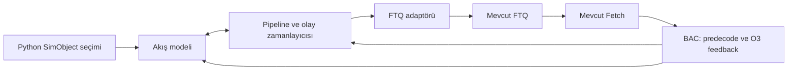

# Seçilebilir decoupled frontend: değerlendirme ve yol haritası

Bu not, yerel gem5 checkout'unun
`f6026859cd1d258e2060762d470c3e47ef385d13` sürümüne dayanır.
Çalışan C++/Python kodunda değişiklik yapılmadı; aşağıdaki yeni sınıflar ve
parametreler tasarım önerisidir. RTL incelemesi `frontend_v4/bpu` ve
`frontend_v4/ftq.sv` taslaklarıyla sınırlıdır; RTL doğruluğu veya çevrim
eşdeğerliği doğrulanmış değildir.

Öneri: BAC, O3 ile haberleşme ve fetch sonrası PC güncelleme görevini korusun.
Tahmin akışı üretimi, zamanlama ve history yönetimi takılabilir bir frontend
bileşenine taşınsın. FTQ genel bir taşıma kuyruğu olarak kalsın. Çoklu CFI ve
geç gelen düzeltmeler için birkaç açık sözleşme genişletmesi yapılsın.

## 1. Mevcut kodun belirlediği sınırlar

| Yer | Mevcut davranış | Tasarım sonucu |
| --- | --- | --- |
| `src/cpu/o3/bac.cc:585` | `generateFetchTargets()` adresleri `minInstSize` adımıyla tarar; ilk BTB hit'inde tahmin üretir. | Mevcut yöntem ne gerçek bir blok lookup'u ne de next-CFI bağlantılarıyla ilerleyen bir modeldir. |
| `src/cpu/o3/bac.cc:620` | Bir çevrimde birden fazla FT/taken tahmini üretilebilir. | Kod tamamen tek tahminle sınırlı değildir; fakat lookup pipeline latency'si modellenmez. |
| `src/cpu/o3/ftq.hh:112` | Her FT üzerinde tek `bpuHistory` vardır. | Bir bloktaki birden fazla tahmini CFI için mevcut payload yetersizdir. |
| `src/cpu/o3/bac.cc:788` | History yalnızca çıkış branch'i eşleştiğinde FT'den alınır. | Çoklu CFI yalnızca payload'a bir vector ekleyerek tamamlanamaz; predecode eşleştirmesi de değişmelidir. |
| `src/cpu/o3/bac.cc:439` | FTQ doluluğu BAC'ı durdurur. | Yeni sorguları durdurmakla çalışan pipeline'ın tamamlanmasını durdurmak ayrılmalıdır. |
| `src/cpu/o3/ftq.cc:199` | `squash(tid)` bütün thread FTQ'sunu temizler. | Bir tahmine kadar koruyup sonrasını silen selective redirect API'si yoktur. |
| `src/cpu/o3/ftq.cc:238` | FT, fetch tüketiminde kaldırılır. | Daha geç mBTB sonucu veya training için metadata ayrı yaşamalıdır. |
| `src/cpu/o3/fetch.cc:762` | `bacResteer()` fetch'ten BAC'a düzeltme gönderir. | Bu, BPU'dan fetch/backend'e override göndermek için hazır bir ters yönlü API değildir. |
| `src/cpu/o3/cpu.cc:380` | BAC, fetch'ten önce tick edilir. | Aynı cycle içinde eklenen FT fetch tarafından görülebilir; cycle fazı açıkça tanımlanmalıdır. |
| `src/cpu/o3/bac.hh:392` | `bacToFetchDelay` saklanır. | İncelenen kodda üretim/tüketim zamanını sınırlayan bir kullanımı yoktur; parametreyi ayarlamak BPU pipeline'ı eklemez. |

`BPredUnit::predict/update/squash` mevcut public arayüzde virtual değildir.
Dolayısıyla yalnızca yeni bir `BranchPredictor` alt sınıfı ve Python seçeneği
eklemek BAC davranışını değiştirmez. Yeni arayüz composition ile kurulmalı;
mevcut BPredUnit bir uyumluluk adaptörü arkasından kullanılmalıdır.

Mevcut decoupled örneği, `requiresBTBHit`, `takenOnlyHistory` ve
`branchPlaceholder()` desteğine dayanır
(`configs/example/gem5_library/fdp-hello.py:282`). Özellikle keşfedilmemiş
branch'leri sonradan history'ye ekleme davranışı, her predictor ile otomatik
olarak uyumlu kabul edilmemelidir.

## 2. Önden hesaplama algoritmasının değerlendirmesi

Burada `m`, simülatörde önden hesaplanan tahmin sayısı olarak varsayılmıştır.
Donanımda da bulunan lookahead derinliğiyse ayrı bir donanım parametresi
olmalıdır; o durumda `m` değişince performansın değişmesi beklenebilir.

mBTB ile bir yol hesaplayıp uBTB'nin o yoldan sapmalarını zamanlamaya dökmek,
host üzerinde hesaplama sırasını değiştiren bir optimizasyon olabilir.
Doğruluk şartı, dışarıdan gözlenen tahminler, history ve zamanlamanın çevrim
çevrim çalışan referans modelle aynı kalmasıdır.

### Tahmin yolu ile mimari doğru yol

mBTB sonucu hâlâ bir tahmindir. uBTB/mBTB farkı bir predictor override'ıdır;
mBTB/gerçek sonuç farkı daha sonra decode/execute kaynaklı düzeltmedir.
mBTB yolu mimari gerçek kabul edilmemelidir. O3'te gerçek instruction
semantiğinin execute aşamasında çalıştırılması da bu ayrımı destekler:
[resmî O3 açıklaması](https://www.gem5.org/documentation/general_docs/cpu_models/O3CPU).

Eşleştirme queue index'i veya yalnızca PC ile yapılmamalıdır. Aynı PC döngüde
birden çok kez bulunabilir. uBTB ve mBTB sonuçları aynı dinamik sorguya ait
`predictionId`, thread ve speculation lineage ile eşleşmelidir. Redirect
sonrasında iptal edilen sorguların geç sonuçları atılmalıdır; hayatta kalan
eski prefix'in sonuçları geçerliliğini korumalıdır.

### `n` cycle gecikmesinin başlangıcı

Latency, initiation interval ve redirect gecikmesi ayrı parametrelerdir:

```text
ready_u(p)    = accepted_issue_u(p) + latency_u
ready_m(p)    = accepted_issue_m(p) + latency_m
redirect(p)   = ready_m(p) + redirect_delay
```

Bu eşitlikler stallsız pipeline içindir. İlgili stage tutulursa tamamlanma
zamanı stage ilerlemelerinden hesaplanır. mBTB, uBTB ile aynı cycle'da
başlamıyorsa iki issue zamanı da farklıdır.

Örneğin aynı cycle'da kabul edilen sorguda `latency_u=1`, `latency_m=4`,
`redirect_delay=0` olsun. uBTB sonucu cycle 1'de, düzeltme cycle 4'te
görünür. Düzeltme-cycle'ında yeni yanlış sorgu çıkarmayan faz sıralamasında
cycle 1, 2 ve 3 boyunca uBTB yolu izlenebilir. Farkın host üzerinde fark
edildiği ana ayrıca dört cycle eklemek doğru değildir.

Yanlış yolda üretilen kayıt sayısı da zorunlu olarak `n` değildir: issue
genişliği, backpressure, mBTB'nin başlama zamanı ve düzeltme fazı belirler.

### İki tahminci arasında karşılaştırılacak bilgi

Sadece target karşılaştırması yetmez. Şunlar ayrılmalıdır:

- CFI varlığı, CFI adresi/offset'i ve türü;
- alınan/alınmayan sonucu ve target;
- fetch aralığı, fallthrough ve ilk alınan CFI;
- sonraki BPU sorgusunun adresi ve `span/next-CFI` bilgisi.

RTL'de `bpu_bp.sv:288`, target aynı olsa bile span farkının sonraki kayıtları
geçersizleştirdiğini açıkça tarif eder. `bpu_nlp.sv:283` de next-CFI/span
düzeltmesini ayrı ele alır. Bunlar yalnızca `nextPC` içeren bir protokole
sığmaz.

### Önden hesaplamanın saklı state üzerindeki etkisi

Canlı predictor üzerinde önce `m` tahmin yapmak GHR, path history ve RAS'ı
ilerletir. Ardından uBTB'yi aynı canlı state üzerinde çalıştırmak farklı bir
model üretir. gem5 `BPredUnit::predict()` speculative history günceller ve
RAS işlemleri yapar (`bpred_unit.cc:211`, `bpred_unit.cc:310`).

Önden hesaplama için ayrı speculative bağlam/snapshot, geri alma desteği ve
prediction başına metadata gerekir. İki tahmincinin history'si, gerçek
donanımın history besleme politikasına göre ilerlemelidir. Hazır sonuçlar
gem5'e görünür kılınırken ikinci kez speculative update yapılmamalıdır.

Tabloların training zamanı, lookup sırasında değişen replacement state,
random-generator state ve sayaçlar da bu sözleşmeye dahildir. Araya giren
training, redirect veya keşfedilen yeni bir CFI bir ön hesabı etkiliyorsa
ilgili suffix yeniden hesaplanmalıdır. Yalnızca timestamp değiştirmek
prediction değerini güncellemez.

`model/tage_modelcc_v2/include/tage.h:54` içindeki `getPrediction/update`
arayüzü, prediction metadata'sını nesnenin ortak alanlarında tutuyor
(`:69`). Bu modeli kullanacaksak birden fazla outstanding prediction için
önce prediction başına token/history eklenmelidir. `m` kez predict edip
daha sonra update etmek mevcut arayüzü doğrudan kullanarak güvenli değildir.

## 3. Queue ve backpressure sözleşmesi

Üç farklı kapasiteyi ayrı tut:

1. **Host ön hesaplama cache'i:** Simülasyonu hızlandırır; donanımda ek
   kapasite, tahmin bant genişliği veya prefetch avantajı sağlamaz.
2. **Modellenen predictor pipeline ve çıkış buffer'ı:** Sonlu kapasitelidir;
   outstanding sorgular ve tamamlanmış ama kabul edilmemiş sonuçlar içerir.
3. **FTQ:** Fetch'e sunulmuş aralıkları taşır; kendi giriş bant genişliği ve
   kapasitesi vardır.

Bir kayıt için en az `issueCycle`, `readyCycle`, `acceptedCycle` ayrımı
yapılmalıdır. FTQ doluyken hazır sonuç buffer'da bekleyebilir. Bu durumda
sonucun hazır olduğu geçmiş an değiştirilmez; kabul anı gecikir. Yeni sorgu
kabulü uygun kredi yoksa durur. Çalışan pipeline ise donanımın elastik/stall
politikasına göre ilerler veya tutulur.

Önceden hesaplanan henüz başlatılmamış sorguların issue zamanı ve onlara
bağımlı sonuçlar yeniden planlanır. Bütün timestamp'lere tek bir offset
eklemek ancak bütün ilgili süreçlerin aynı miktar durduğu özel modelde
geçerlidir; bağımsız mBTB tamamlanmalarını ve backend feedback'ini de
geciktirmek genellikle yanlıştır.

Kontrol olayları, FTQ alanı bekleyen veri kayıtlarının arkasında kalmamalıdır.
Mantıksal olaylar `FastResult`, `SlowResult`, `Override`, `Cancel` gibi
türler taşımalı; FTQ'ya yayınlanacak veri sırası ayrıca tutulmalıdır.
Örneğin FTQ doluyken bir override eski kayıtları iptal ederek alan açabilir.

Önerilen cycle fazları: önce geçerli backend/predecode feedback'i; sonra
pipeline tamamlanmaları ve override arbitration; ardından FTQ'ya hazır
çıktıların kabulü; son olarak yeni sorguların issue edilmesi. Aynı cycle'daki
çatışmalar dinamik yaş ve path geçerliliğiyle çözülmelidir. Birbirinden
bağımsız olmayan olaylara yalnızca sabit kaynak önceliği uygulamak yetmez.

## 4. Ortak mimari



Üç sorumluluğun sınırı açık olsun; her yardımcı sınıfın ayrı SimObject
olması şart değildir:

| Parça | Sorumluluk |
| --- | --- |
| `StreamModel` | Sorgu adresi, CFI keşfi, direction/target, next-fetch ve next-query hesabı; history ve training işlemleri. |
| `FrontendScheduler` | Latency, initiation interval, outstanding limit, kapasite, sonuçların yayın zamanı ve override olayları. |
| `FTQAdapter` | Ortak sonucu FetchTarget'a çevirme, admission, dinamik kimlik eşleme ve O3'ün mevcut lifecycle'ına bağlama. |

BAC yeni bileşeni tick eder ve feedback'i iletir. Her model için BAC içine
`if (block) / else if (cfi) / else if (custom)` dalları eklenmez.
`LegacyScanModel` mevcut adres tarama davranışını temsil eder;
`BlockStreamModel`, `CfiStreamModel` ve üçüncü özel model aynı sözleşmeyle
çalışır. Legacy predictor için adaptör mevcut BPredUnit fonksiyonlarını
kullanır; özel model aynı history lifecycle'ını kendi token'larıyla sağlar.
Canlı speculative state ve training'in sahibi tek olmalıdır.

Ortak bir tahmin paketi şu bilgileri taşımalı:

```text
PredictionPacket
    tid, predictionId, pathGeneration, parentPredictionId
    queryPC                         # predictor'a verilen adres
    fetchStartPC, fetchEndPC         # kesintisiz fetch aralığı
    nextFetchPC, nextQueryPC         # birbirinden bağımsız
    ordered CFI[]:
        cfiId, PC, type, instructionLength/known
        predictedTaken, target, fallthrough, historyToken
    timing metadata / source stage
```

Adresler/PC state ISA semantiğini korumalıdır. Legacy FetchTarget'ın
`endPC`/`inRange` sözleşmesi inclusive'dir; adaptör sessizce exclusive byte
sınırı varsaymamalıdır. RISC-V compressed instruction ve blok sınırını aşan
instruction için instruction uzunluğu ile lookup adımı birbirinden ayrıdır.

`nextQueryPC`, branch'ten sonraki branch'in adresi olabilir; `nextFetchPC`
ise önce aradaki normal instruction'ları fetch etmek zorundadır. CFI
adreslemesi bu instruction'ların atlanması anlamına gelmez. CFI keşfi
BTB/span metadata'sından yapılmalı, bulunamazsa tanımlı sequential fallback
uygulanmalıdır. Önceden instruction decode ederek bedelsiz oracle kurulmaz.

Bir blokta CFI'lar adres/program sırasıyla değerlendirilir. İlk alınan
CFI'dan sonraki aynı sequential blok instruction'ları o path'e dahil
edilmez. Birden fazla taken geçiş bir cycle'da desteklenebilir, fakat
kesintisiz olmayan adresler tek FetchTarget aralığına yerleştirilemez.
Çoklu branch'in aynı başlangıç history'siyle mi yoksa sıralı history
güncellemesiyle mi tahmin edildiği modelin açık politikası olmalıdır.

Arayüzün temel işlemleri `advance(now)`, `peekReady()`,
`accept(predictionId)`, `onDecoded(...)`, `onCommit(...)`,
`redirect(...)`, `reset/drain` ve `nextWakeup/hasPendingWork` olabilir.
`peek` tekrar çağrılınca tahmin veya history yeniden üretilmemelidir.
Pipeline ilerlemesi FTQ admission'dan ayrı çağrılmalıdır.

## 5. Çoklu CFI için değişiklik bütçesi

**İlk prototip:** Bir blok prediction'ını mevcut tek-CFI FT'lere bölmek.
Mevcut `updatePreDecode` ve history taşıma yolunun çoğu korunur.

Bu yaklaşım işlevsel smoke test için uygundur; aynı blok iki CFI içerirse
iki FTQ slotu tüketebilir. Bu nedenle FTQ occupancy, admission bandwidth,
fetch akışı ve FDP prefetch davranışı native blok modeliyle aynı değildir.
Sadece FTQ derinliğini sabit katsayıyla büyütmek genel bir düzeltme değildir.

**Kalıcı öneri:** FetchTarget'a sıralı per-CFI prediction/history metadata'sı
eklemek veya opaque handle ile eşdeğer metadata'yı adaptörde tutmak.
Bir donanım bloğu bir FTQ slotu tüketmeye devam eder. Şunlar sınırlı ölçüde
değişir:

- `BAC::updatePreDecode`: yalnızca exit branch'e bakmak yerine doğru CFI
  token'ını bulur; ilgili token'daki tahmin ve target'ı kullanır.
- `BAC::squashBpuHistories`: FT'leri ve FT içindeki CFI'ları ters dinamik
  sırayla geri alır; queue'da henüz yayınlanmamış daha genç history'ler de
  önce geri alınır.
- `FTQ::popHead/squashSanityCheck`: tek pointer yerine tüketilmemiş bütün
  prediction metadata'sını denetler.
- FetchTarget çıkışı ve gerekiyorsa dar fetch kontrolü: iç not-taken CFI
  paketi bitirmez; alınan CFI paketi bitirir. Blok içine geri dönen bir
  target bile yeni dinamik paket oluşturur.

Her CFI için `predictionId + cfiId -> InstSeqNum` bağlanır. FTSeqNum ile
InstSeqNum aynı sayı türünde olsa bile farklı yaşam evreleri ve sıralama
alanlarıdır; birbirleri yerine kullanılamaz. PC tek başına kimlik değildir.

## 6. Override ve metadata yaşam süresi

Mevcut FTQ tam squash mekanizması yeterli değildir. Üç durum ayrılır:

| Düzeltme geldiğinde durum | Gerekli işlem |
| --- | --- |
| Etkilenen çıktı henüz yayınlanmadı | İç buffer/suffix ve speculative history geri alınır; yeni yol planlanır. |
| FTQ'ya yayınlandı, etkilenen instruction henüz fetch edilmedi | Kaynak paketin gerekli alanları düzeltilir; genç FT'ler selective squash edilir. |
| Etkilenen instruction veya gençleri fetch/decode/rename'a ilerledi | Dinamik instruction sınırına göre uygun pipeline flush ve fetch redirect gerekir. |

İkinci durumda `squashAfter(tid, ftId)` benzeri dar bir FTQ işlemi,
paket içi CFI sınırı ve history cleanup sözleşmesi yeterli olabilir.
Üçüncü durumda yalnızca BAC'ın PC'sini veya FTQ'yu değiştirmek yetmez.
Fetch'e açık redirect bildirimi ve gerekiyorsa O3 squash arbitration'ına
bağlantı gerekir. Değişiklik kümesi `fetch`, `comm`, kimlik eşlemesi ve
mevcut squash dağıtım noktasına kadar genişleyebilir.

Override bir çözülmüş branch sonucu değildir. Mevcut
`BPredUnit::squash(sn, target, taken, ...)` çağrısını doğrudan kullanmak
`actuallyTaken`, misprediction sayaçları ve BTB training davranışını
etkiler (`bpred_unit.cc:520`, `:579`). Predictor düzeltmesi için speculative
onarım ile gerçek çözüm/training birbirinden ayrılmalıdır. Decode/execute
aynı branch için daha önce gerçek sonuç üretmişse geç override onu ezemez.

Gereken invariant: yürütmenin kullandığı prediction/target ile history'de
saklanan son geçerli prediction tutarlı kalır. Yokluğu veya CFI offset'i
değişen branch için gerekirse source instruction da yeniden fetch edilir.
Eksik dinamik kimlik eşlemesinde sessizce yanlış suffix silinmez.

Backend bağlantısını geciktiren bir prototip, yalnızca doğrulanmış
paketleri fetch'e açabilir. Bu ayrıca adlandırılmış sınırlı bir modeldir:
uBTB'nin geçici yolunun I-cache/fetch/backend üzerindeki etkilerini temsil
etmez ve tam erken yayın modeliyle eşdeğer diye raporlanamaz.

RTL `ftq.sv:80` ayrı `wptr/rptr/bp_ptr/cptr` taşır; `bpu_done_i` kayıt
serbest bırakmayı yönetir. Bu `cptr`, kodda backing predictor done ptr
olarak tarif edilmiştir; mimari instruction commit ile özdeş değildir.
gem5 FTQ ise fetch tüketiminde slotu bırakır. RTL kapasite davranışını
korumak için adaptörde ayrıca donanım slot rezervasyonu/retention ledger'ı
tutulabilir; fetch tüketti diye slow predictor metadata'sı silinmez.
Admission hem taşıma kuyruğunun hem modellenen donanım kapasitesinin
kredilerine bakar; aynı paket kapasite hesabında iki kez sayılmaz.

FDP açıksa `FTQInsert/FTQRemove` bildirimleri korunmalıdır. In-place aralık
değişiminde prefetcher'a da geçerli değişim/cancel semantiği sağlanmalıdır.
Geçersiz yol adına daha önce yapılmış cache erişimlerinin fiziksel etkileri
geriye dönük silinmez; geç yanıtların doğru path'e bağlanması engellenir.

## 7. Python seçimi

Aşağıdaki isimler yeni öneridir; bugün çalıştırılabilir config değildir:

```python
cpu.decoupledFrontEnd = True
cpu.frontend = DecoupledFrontend(
    model=BlockStreamModel(blockBytes=32, maxCFIs=4),
    timing=CyclePipeline(
        fastLatency=1,
        slowLatency=4,
        slowInitiationInterval=1,
        redirectDelay=0,
        resultBufferEntries=4,
    ),
)

# Aynı CPU bağlantısıyla farklı sorgu/ilerleme modelleri:
cpu.frontend.model = CfiStreamModel()
# veya:
cpu.frontend.model = CustomStreamModel()

# Doğruluk sağlandıktan sonraki host optimizasyonu:
cpu.frontend.timing = BufferedLookahead(batchSize=64)
```

Bir çalıştırmada modellerden yalnızca biri seçilir; config sonrasında
çalışan CPU üzerinde hot-swap önerilmemektedir. Batch implementasyonu
CyclePipeline'ın donanım parametrelerini ve dış davranışını korumalıdır.
İlk entegrasyonda `frontend=NULL` mevcut BAC yolunu koruyabilir. Daha sonra
eşdeğerliği kanıtlanmış `LegacyScanModel` ile tek arayüze geçirilebilir.
Python yalnızca konfigürasyon yapar; cycle başına Python callback gerekmez.

Geçersiz kombinasyonlar başlangıçta reddedilmeli: desteklenmeyen history
politikası, sıfır kapasite/genişlik veya henüz desteklenmeyen SMT gibi.
Mevcut BAC ve fetch decoupled modda `numThreads > 1` için fatal üretir;
SMT ayrı bir geliştirme aşamasıdır.

## 8. Uygulama sırası ve kabul ölçütleri

| Aşama | Somut teslim | Kabul ölçütü |
| --- | --- | --- |
| 0 | Cycle fazları, `m/n`, history/training, blok sınırı ve slot serbest bırakma sözleşmesi | Aynı örnek trace herkes için aynı issue/ready/redirect zamanını verir. |
| 1 | Opsiyonel frontend SimObject, ortak packet ve legacy adaptörü | Mevcut baseline ile aynı retired PC akışı, sonuç ve cycle sayısı; coupled yol korunur. |
| 2 | Çevrim bazlı reference scheduler, kimlikler, bounded buffer ve lifecycle | Hazır sonuç FTQ-full altında kaybolmaz; stale sonuç yayınlanmaz; bekleyen iş CPU'yu uyandırır. |
| 3 | Çoklu-CFI payload/adaptör ve Block/Cfi modelleri | Aynı blokta iki CFI, içeriye giriş, ilk taken ve next-CFI arası normal instruction'lar doğru işlenir. |
| 4 | uBTB/mBTB erken yayın ve override yolu | Tampon, FTQ ve fetch edilmiş durumlarda doğru suffix/history temizlenir; gerçek sonuçla override çakışması doğru çözülür. |
| 5 | Özel predictor modeli ve prediction başına token/training adaptörü | Call/return, indirect, surprise branch ve backend squash sonrası history eşdeğerliği sağlanır. |
| 6 | `m` tahminli önden hesaplama optimizasyonu | `m=1,8,64` aynı simulated trace/cycle/state üretir; yalnızca host çalışma süresi değişebilir. |
| 7 | Karşılaştırmalı ölçüm, gerekiyorsa SMT | Aynı kaynak bütçelerinde IPC/MPKI, FTQ stalls ve override etkileri raporlanır. |

Aşama 2'nin küçük testleri için sabit sonuç veren sahte predictor yeterlidir;
tam uBTB/mBTB entegrasyonunu beklemek gerekmez. Aşama 4 tamamlanmadan erken
yayın modelinden tam frontend performans sonucu çıkarılmaz.

Başlıca kod temasları: `bac.hh/.cc`, `BaseO3CPU.py`, O3 `SConscript`;
çoklu CFI/selective squash için `ftq.hh/.cc`; geç override için dar
`fetch/comm` ve squash bağlantıları. Model ve scheduler implementasyonları
yeni dosyalarda tutulur. Özel BPU algoritması FTQ içine yerleştirilmez.

Doğrulama senaryoları: u/m anlaşması; direction/target/offset/span farkı;
aynı PC'nin birden fazla outstanding örneği; aynı blokta iki CFI; RVC ve
sınır aşan instruction; FTQ-full sırasında slow sonuç ve redirect; kısmi
packet tüketimi; mBTB'nin de yanlış olması; call/return rollback; BTB miss;
decode/execute düzeltmesiyle aynı cycle; drain/resume ve CPU switch.

History lifecycle sırası, aynı speculative state'i paylaşan history'lerde
en gençten en eskiye rollback olmalıdır: yayınlanmamış outstanding state,
FTQ'daki state ve sonra fetch sonrası instruction history'si. Her token
yalnızca bir kez commit veya squash edilir. Drain kontrolü FTQ boşluğuna
ek olarak pending pipeline/event/history durumunu da kapsar.

Ölçümler ayrı tutulmalı: fast/slow lookup sayısı, override nedeni ve yaşı,
wrong-path fetch bytes, FTQ ve predictor buffer occupancy, stall nedenleri,
backend misprediction ve IPC. Host ön hesaplama tekrarları donanım lookup
sayaçlarını artırmamalıdır.

C++ implementasyonu başladığında derlemeler 12 iş ile çalıştırılmalı:
önce dar nesne/test hedefleri, sonra gerekirse
`scons -Q build/RISCV/gem5.opt -j12`. Bu not için derleme/simülasyon
çalıştırılmadı; kaynak incelemesi ve Markdown whitespace kontrolü yapıldı.
